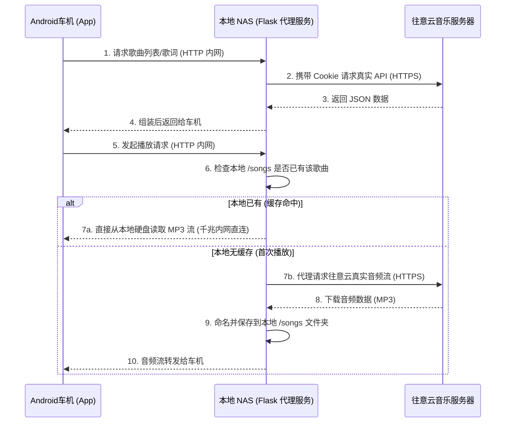

# MyFM 老车机拯救计划 (MyFM Car Audio Proxy)

这是一个专为**老旧 Android 车机 (Android 4.x)** 量身打造的往意云音乐播放解决方案。
完美兼容安卓4车机，**Android API 14**以上的型号理论上都支持，cookies保存在服务端，支持往意云私人FM、每日推荐、热歌榜3个功能，同时极度轻量化，apk只有15K。

## 🌟 核心特性 (Features)

* **📻 专属电台与日推**：支持往意云账号短信验证码登录，获取高音质“私人FM”及“每日推荐”，还有公开的热歌榜 。
* **🚀 彻底解决 -1004 报错**：因老款设备因底层协议过时（不支持 TLS 1.2+）而导致的 `-1004` 等各种网络握手报错，利用 NAS 作为中转代理，将现代强制 HTTPS 流量转换为纯内网 HTTP 数据流，让再老的车机都能秒开音频。
* **💾 私有云曲库沉淀**：播放过的每一首歌，都会被后台自动下载并重命名为 `歌手 - 歌名 (ID).mp3`，永久保存在服务器的 `songs/` 目录下，再也不怕喜欢的歌变灰下架！
* **⚙️ 混合双擎架构 (Hybrid JSBridge)**：极简的 Web UI 跑在 Android WebView 中，但核心音频流交由 Android 底层原生的 `MediaPlayer` 硬件解码，保障极低内存占用与高保真输出。
* **🛡️ 后台保活机制**：内置 Foreground Service 与 WakeLock，完美支持车机锁屏、切导航等后台场景下不间断播放，支持车机方向盘物理按键（上一首、下一首、暂停）。

## 🛠️ 部署指南 (Deployment)

### 第一步：启动服务端 (基于 Docker)

我们推荐使用 Docker Compose 将服务端部署在您的 NAS、旁路由或任何处于同一局域网的服务器上。

1. 新建项目根目录，任意命名，在其下创建cookies.json 和 songs 文件夹
2. 下载docker-compose.yml到根目录，执行

```bash
docker-compose up -d
```

> **提示**：
> cookies.json（保存您的登录状态）
> songs 文件夹（保存您听过的所有高音质音乐，生成私人乐库）

### 第二步：安装并配置车机 App

1.  **自动编译 (推荐)**：下载**Releases** 页面最新生成的 `MyFM-debug.apk`。
2.  将 APK 安装到车机。
3.  初次启动，输入服务端地址（如 `http://192.168.x.x:5000`）。
4.  在网页中输入手机号和验证码登录，开启你的专属 MyFM 之旅！

## 🏗️ 架构说明

1. **Server (后端)**：基于 Python Flask 搭建的轻量级中转站，负责解析往意云 API、抓取真实音频地址并缓存到本地，向车机提供内网直连（HTTP Range 支持）。
2. **Web (前端)**：采用原生 ES5 编写的控制页面，完美兼容几十年前的内置浏览器内核（无白屏、无语法报错）。
3. **Android App (车机端)**：基于 Java 的极简 WebView 壳，注入了 `window.AndroidPlayer` 桥接对象。

### 数据流向图 (Data Flow)

整个系统已经实现了**车机与往意云服务器的完全物理隔离**。您的车机现在只与您的局域网 NAS 通信，这彻底避开了老安卓系统无法建立现代 HTTPS 连接的问题：



## 💡 常见问题 (FAQ)

**Q：为什么我在车机上点下一首没反应？**
A：请确保您的安卓端 `app.js` 已经更新到最新。如果旧版缓存顽固，可以在车机设置中“清除应用数据”，再次打开 App 时在地址末尾加上 `?v=2`（例如 `http://192.168.x.x:5000/?v=2`）来强制打破 WebView 缓存。

**Q：点击通知栏的“私人FM在后台运行中”会导致歌曲从头开始？**
A：请检查 `AndroidManifest.xml` 中 `MainActivity` 是否配置了 `android:launchMode="singleTask"` 属性。

## 📄 License
MIT License
